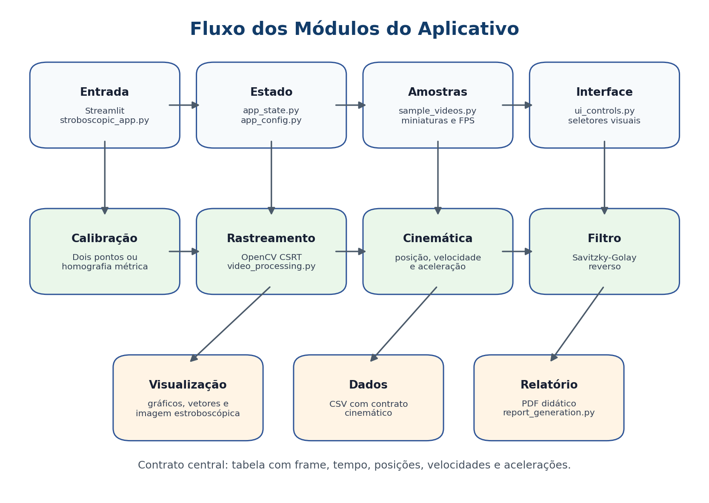
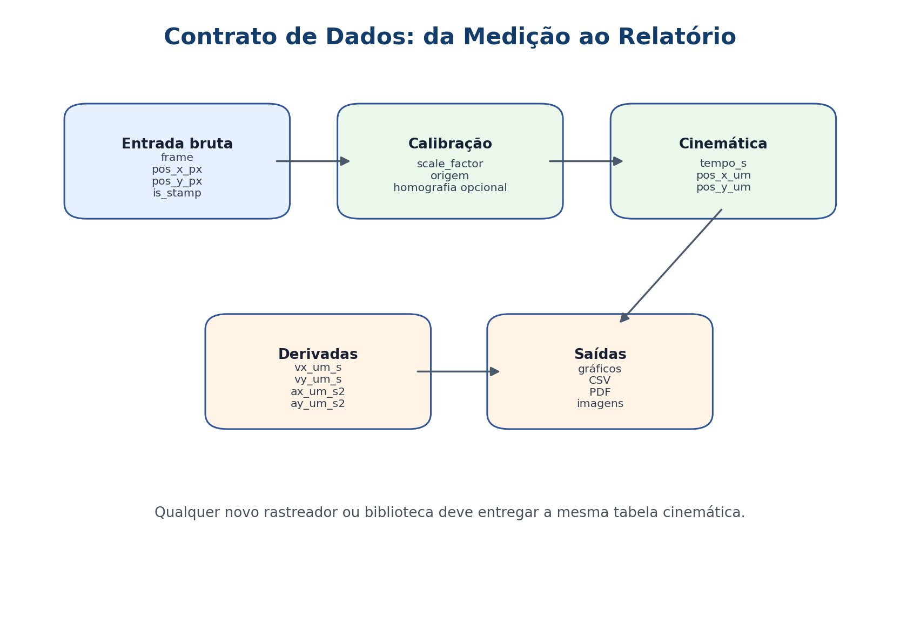

# Contratos dos módulos

Este app mantém `stroboscopic_app.py` como ponto de entrada do Streamlit e separa os blocos matemáticos/computacionais em módulos com responsabilidades claras.

## Mapas visuais





## Entrada Streamlit

`stroboscopic_app.py`

- Orquestra telas e estado de interface.
- Não deve conter regra matemática nova quando ela puder ficar em módulo separado.
- Chama os contratos dos módulos abaixo.

## Estado e configuração

`app_config.py`

- Define caminhos, extensões aceitas, CSS da interface e presets de densidade estroboscópica.
- Contrato principal: `STAMP_DENSITY_PRESETS`.

`app_state.py`

- Limpa e carrega estado de vídeo no `st.session_state`.
- Contratos principais: `reset_video_state()` e `load_selected_video(...)`.

## Vídeos de validação

`sample_videos.py`

- Descobre a pasta de vídeos de validação.
- Extrai FPS, duração, resolução e miniaturas.
- Contratos principais: `list_validation_videos()` e `make_video_thumbnail(path)`.

## Visualização

`visualization.py`

- Gera grade cartesiana, gráficos cinemáticos e vetores de velocidade.
- Contratos principais: `plotar_graficos(df)`, `desenhar_grade_cartesiana(frame)` e `desenhar_vetores_velocidade(...)`.

## Processamento de vídeo

`video_processing.py`

- Recebe vídeo, intervalo, caixa de rastreio, escala e parâmetros.
- Devolve imagem estroboscópica, tabela, gráficos, vídeo rastreado e metadados de Savitzky-Golay.
- Quando a homografia métrica está ativa, transforma as coordenadas do objeto para o plano métrico sem distorcer a visualização original usada no rastreio.
- Preserva `view_x_px` e `view_y_px` para produtos desenhados sobre o frame original.
- Contrato principal:

```python
processar_video(
    video_bytes,
    initial_frame,
    start_frame_idx,
    end_frame_idx,
    bbox_coords_opencv,
    fator_distancia,
    scale_factor,
    origin_coords,
    status_text_element,
    ...
)
```

Saída esperada:

```python
(img_estrob_bytes, df_final, figura_graficos, video_track_bytes, savgol_metadata)
```

## Homografia métrica

`perspective_calibration.py`

- Constrói uma homografia a partir de quatro pontos de um retângulo real no plano do movimento.
- Devolve matriz, dimensão retificada e escala espacial.
- Estima resolução de planta automaticamente quando o usuário informa as dimensões reais do plano.
- Contratos principais: `build_metric_homography(...)`, `aplicar_homografia(...)` e `estimate_pixels_per_unit(...)`.

## Savitzky-Golay reverso

`savgol_reverse.py`

- Estima automaticamente janela e ordem do filtro a partir da trajetória bruta.
- Devolve um único par ótimo `(window_size, poly_order)` para o vídeo carregado.
- A seleção minimiza custo computacional entre candidatos com erro físico-numérico equivalente ao mínimo observado.
- Aplica suavização e derivadas numéricas.
- Contratos principais: `optimize_savgol_parameters(...)` e `apply_savgol_kinematics(...)`.

## Controles de interface

`ui_controls.py`

- Renderiza controles reutilizáveis da interface.
- Contrato principal: `render_stamp_density_selector()`, que devolve um preset com:
  - `label`
  - `spacing_units`
  - `point_count`
  - `description`

## Relatório do estudante

`report_generation.py`

- Gera PDF estruturado com os produtos finais da análise.
- Personaliza a primeira página com equipe, série/turma e data da análise.
- Inclui estudo estatístico da aceleração vertical, com média, mediana, variância e desvio padrão.
- Entrada principal:
  - contexto da análise;
  - imagem de calibração;
  - imagem estroboscópica;
  - tabela cinemática;
  - figura de gráficos;
  - metadados do Savitzky-Golay;
  - imagem opcional de vetores.
- Contrato principal: `generate_student_report_pdf(...)`, que devolve bytes de PDF prontos para `st.download_button`.

## Regra de ouro

O contrato central do método é a tabela:

```text
frame, tempo_s, pos_x_px, pos_y_px, pos_x_um, pos_y_um, vx_um_s, vy_um_s, ax_um_s2, ay_um_s2
```

Em modo de homografia, `view_x_px` e `view_y_px` também são exportados para indicar a posição do objeto no vídeo original. Desse modo, a visualização permanece fiel ao frame de origem, enquanto `pos_x_px` e `pos_y_px` podem representar o plano métrico retificado.

Qualquer troca futura de rastreador, biblioteca de vídeo ou interface deve preservar essa tabela como saída do pipeline.
