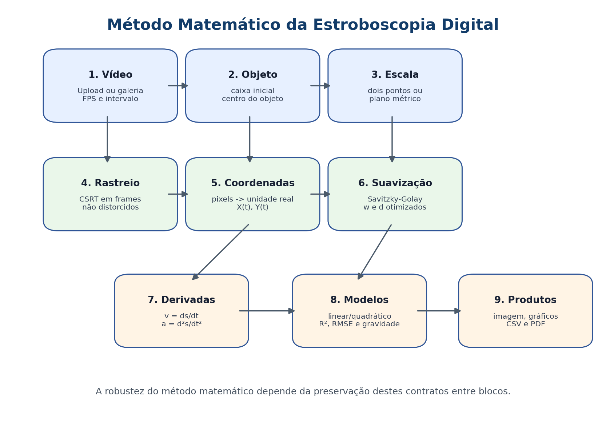

# Método e fluxos dos módulos

Esta documentação separa o método matemático de estroboscopia digital das limitações das ferramentas computacionais. A ideia central é preservar contratos claros entre módulos: o rastreador pode evoluir, a biblioteca pode ser substituída, mas a tabela cinemática final deve manter a mesma estrutura.

## Fluxo dos módulos


O aplicativo é organizado em blocos: entrada Streamlit, estado, galeria, calibração, rastreio, cinemática, filtro, visualização, CSV e relatório. Cada bloco possui uma responsabilidade pequena e um contrato de entrada/saída.

## Método matemático



O método começa com o vídeo e a seleção do objeto. Em seguida, a escala espacial é definida por dois pontos ou por homografia métrica. O rastreio fornece posições, a calibração converte essas posições para unidades reais, o filtro Savitzky-Golay suaviza a trajetória e as derivadas produzem velocidades e acelerações. Os modelos ajustados interpretam o movimento.

## Contrato dos dados


A tabela cinemática é o contrato central do projeto:

```text
frame, tempo_s, pos_x_px, pos_y_px, pos_x_um, pos_y_um,
vx_um_s, vy_um_s, ax_um_s2, ay_um_s2
```

Esse contrato permite que o método matemático seja preservado mesmo se futuramente o rastreador CSRT for trocado por outro algoritmo.

## Etapas matemáticas principais

| Etapa | Fórmula / regra | Interpretação |
| --- | --- | --- |
| Centro do objeto | `p_x = x_caixa + w/2`, `p_y = y_caixa + h/2` | Reduz a caixa do rastreador a um ponto representativo. |
| Tempo | `t = (frame - frame_inicial) / FPS` | Converte frames em segundos. |
| Escala | `S = d_real / d_px` | Converte pixel em unidade real. |
| Coordenadas físicas | `X = (p_x - O_x)S`, `Y = -(p_y - O_y)S` | Coloca a origem no sistema definido pelo usuário. |
| Homografia métrica | `p' = H p` | Projeta pontos do vídeo para um plano métrico sem distorcer a visualização do vídeo. |
| Modelo horizontal | `X(t) = v_x t + X_0` | Representa velocidade horizontal aproximadamente constante. |
| Modelo vertical | `Y(t) = at² + bt + c`, `a_y = 2a` | Estima aceleração vertical a partir do coeficiente quadrático. |
| Savitzky-Golay | ajuste polinomial local de ordem `d` em janela `w` | Suaviza a trajetória e permite derivadas numéricas. |

## Imagens geradas

Os diagramas desta pasta são gerados por:

```bash
python scripts/generate_documentation_diagrams.py
```

Arquivos produzidos:

- `docs/figures/fluxo_modulos_app.png`
- `docs/figures/fluxo_metodo_matematico.png`
- `docs/figures/contrato_dados_pipeline.png`
